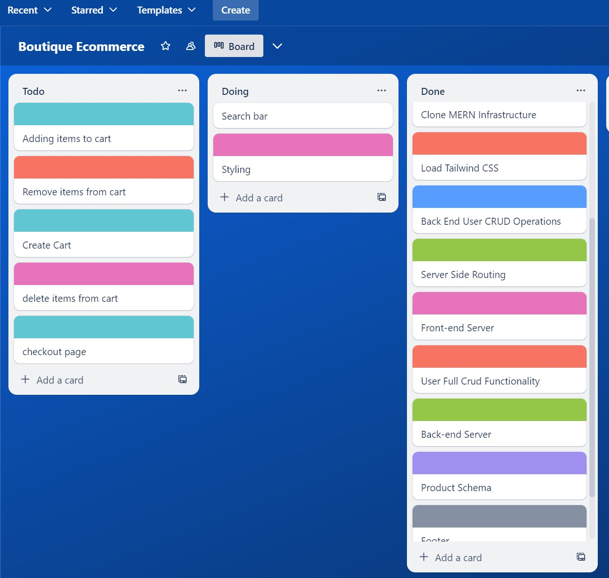

## Boutique Ecommerce 
inspiration from a webflow and shopify template ecommerce sites
images from webflow

## Wirefram
*LINK - https://app.diagrams.net/#G1AkhnUgY23nh3pHiXi-BD4KzKMqkp2l1P

## Tech Tools
project built with: 
* HTML/CSS
* Javascript
* React
* NodeJS
* MongoDB
    * MongoDB used as noSQL database to store and retrieve the project data.
* Mongoose 
    *Mongoose used alongside Mongoose to carry out backend crud operations through the front-end
* Tailwindcss
* ExpressJS
## HOSTING
*LINK - render.com 
This project is hosted on render 
this production version is: *LINK - https://boutique-nay4.onrender.com/
## Trello board
Trello board checked daily for project tracking. 
*

## AUTHENTICATION
* user gets registered, user password is hashed before it get stored into the databse with bcrypt.

* Dotenv is used to parse api keys and passwords secretly from the fron-end to the back-end