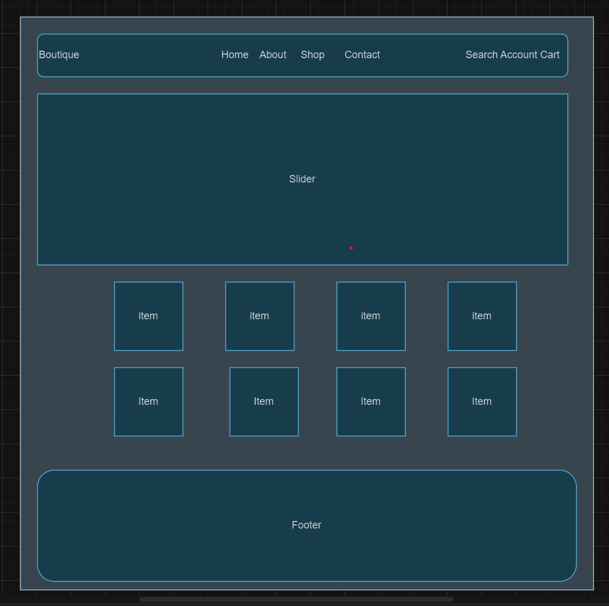

## Boutique Ecommerce 
inspiration from a webflow and shopify template ecommerce sites
images from webflow

## Diagram 
*LINK - https://app.diagrams.net/#G1AkhnUgY23nh3pHiXi-BD4KzKMqkp2l1P

## Tech Tools
project built with: 
* HTML/CSS
* Javascript
* React
* NodeJS
* MongoDB
    * MongoDB used as noSQL database to store and retrieve the project data.
* Mongoose 
    *Mongoose used alongside Mongoose to carry out backend crud operations through the front-end
* Tailwindcss
* ExpressJS

## Trello board
Trello board checked daily for project tracking. 

